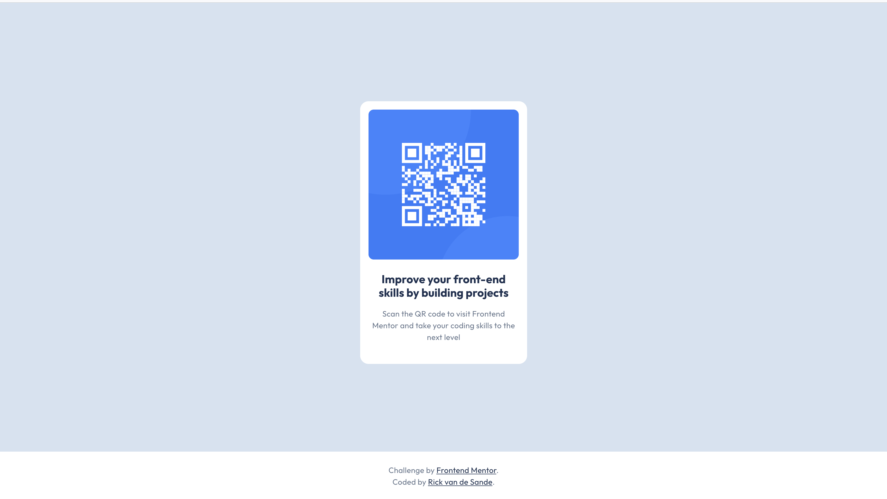

# Frontend Mentor - QR code component solution

This is a solution to the [QR code component challenge on Frontend Mentor](https://www.frontendmentor.io/challenges/qr-code-component-iux_sIO_H). Frontend Mentor challenges help you improve your coding skills by building realistic projects. 

## Table of contents

- [Overview](#overview)
  - [Screenshot](#screenshot)
  - [Links](#links)
- [My process](#my-process)
  - [Built with](#built-with)
  - [What I learned](#what-i-learned)
- [Author](#author)

## Overview

### Screenshot

### Links

- Solution URL: (https://rickvandesande.github.io/FEMNTR-QR-code-component/)
- Live Site URL: (https://github.com/rickvandesande/FEMNTR-QR-code-component)

## My process

### Built with

- Semantic HTML5 markup
- CSS custom properties
- Flexbox

### What I learned

Fairly straightforward solution. Didn't take to long. Had some issues with centering the div with the QR code in the screen.

I was not sure how to go about centering the QR code on the screen. In the end I opted to make the <main> have a height of 100svh - the size of the footer. Don't know if this is the best solution for it and would like to hear other approaches for this.

## Author

- GitHub - [Rick van de Sande](https://github.com/rickvandesande/FEMNTR-QR-code-component)
- Frontend Mentor - [@rickvandesande](https://www.frontendmentor.io/profile/rickvandesande)
